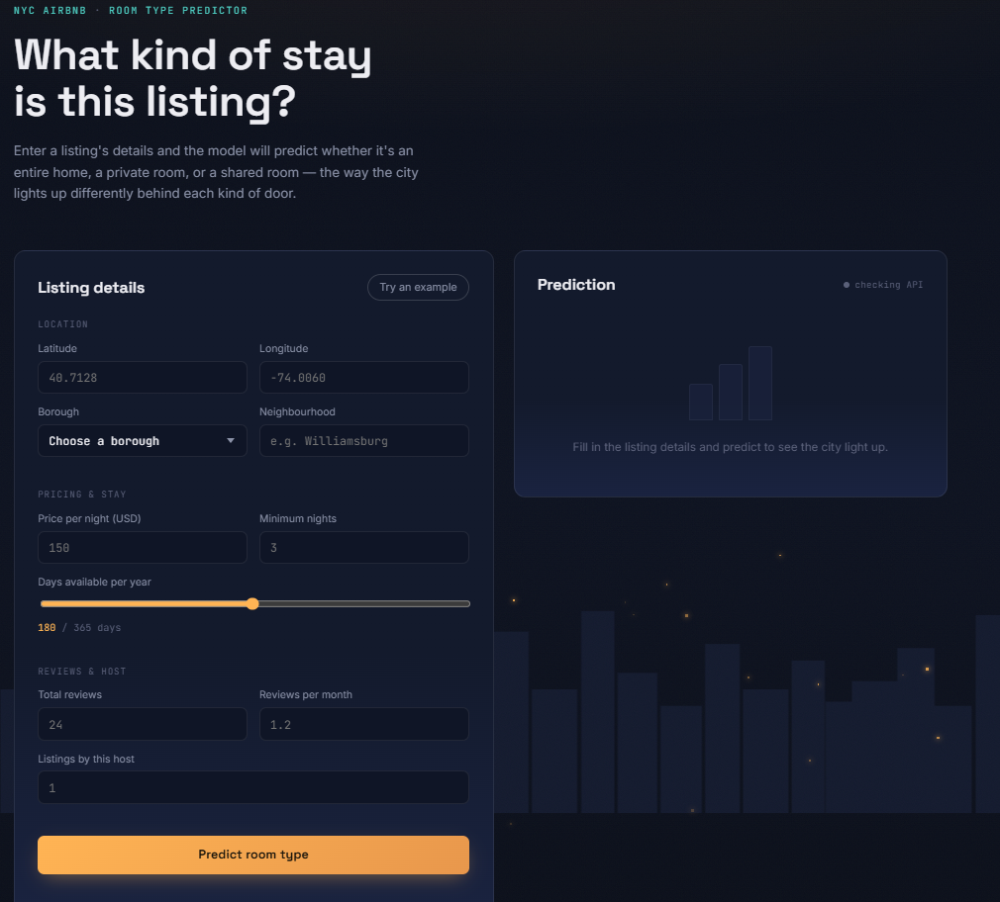
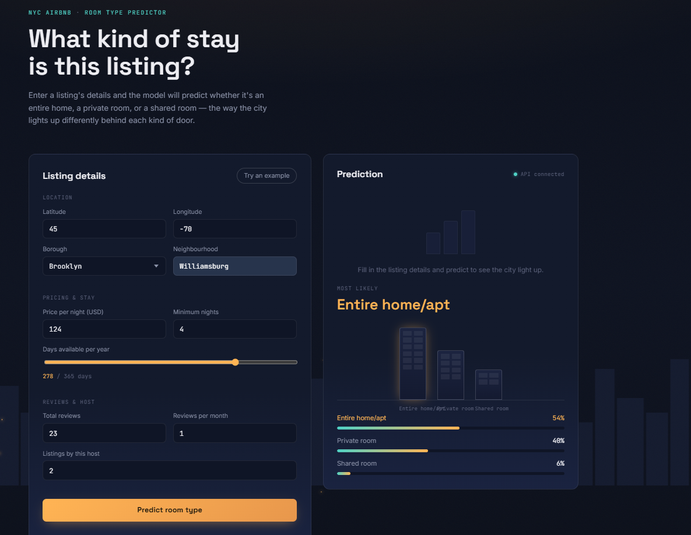
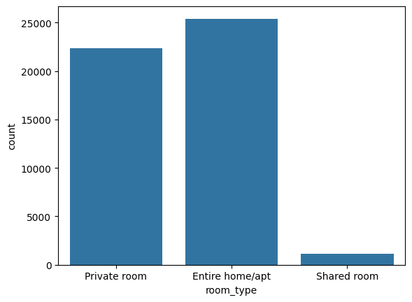
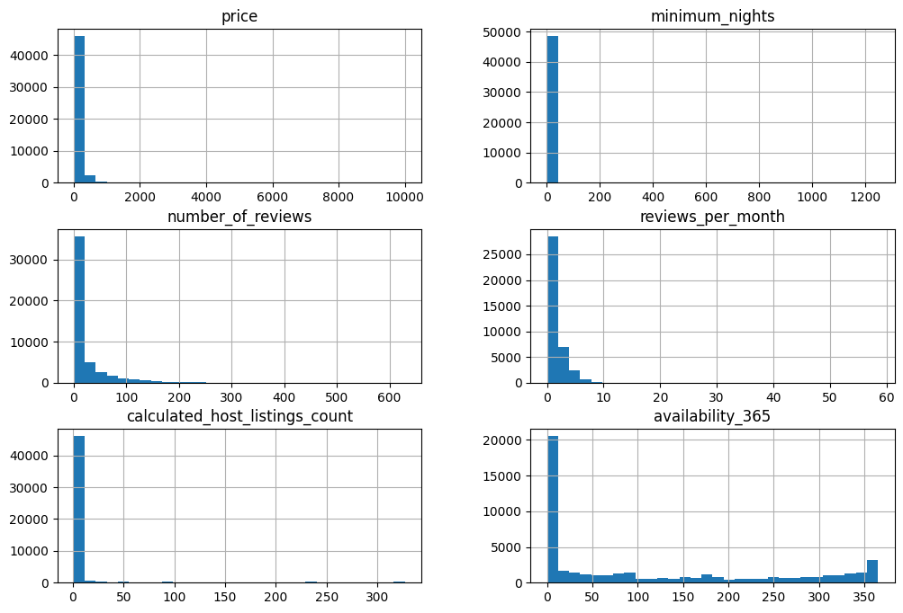
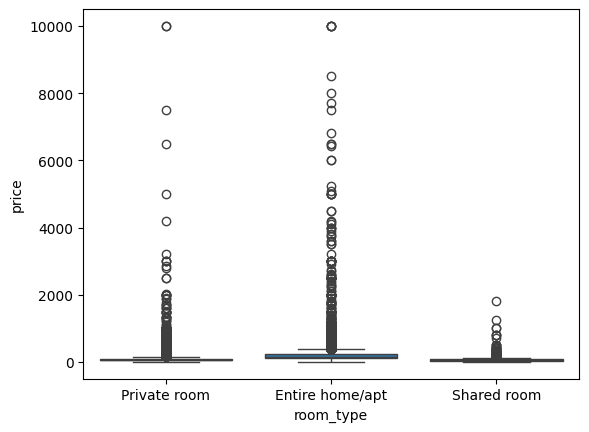
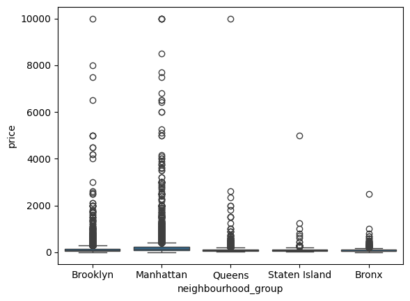
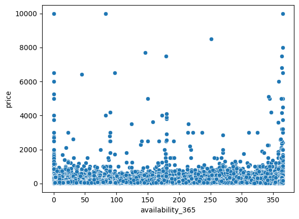
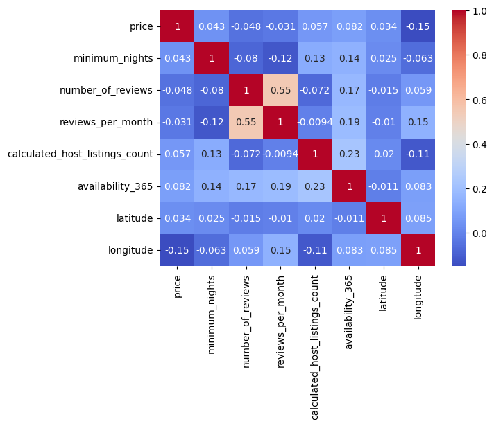
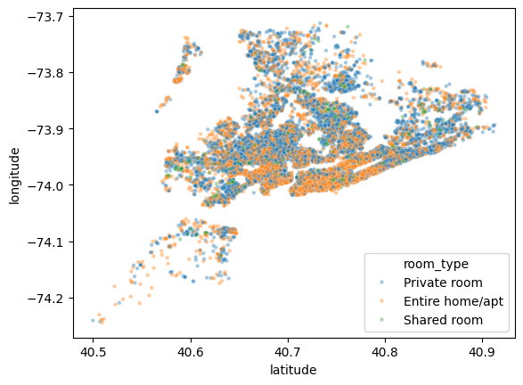
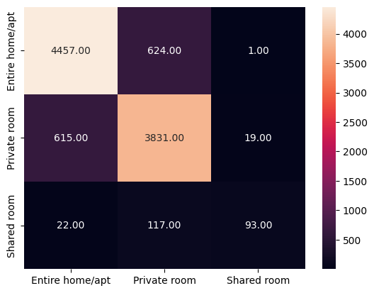

# 🗽 NYC Airbnb Room Type Predictor

**What kind of stay is this listing?** — An end-to-end ML project that predicts whether an NYC Airbnb listing is an **Entire home/apt**, **Private room**, or **Shared room**, based on its location, price, and booking activity — served through a FastAPI backend and a city-skyline-themed web UI.

<p align="center">
  
  
</p>

---

## ✨ Features

- 📍 **Location-aware predictions** — uses latitude, longitude, borough, and neighbourhood
- 💰 **Pricing & stay inputs** — price per night, minimum nights, and days available per year
- ⭐ **Reviews & host signals** — total reviews, reviews per month, and listings per host
- 📊 **Confidence breakdown** — predicted probability for each of the three room types
- ⚡ **FastAPI backend** — serves a trained scikit-learn pipeline behind a `/predict` REST endpoint
- 🎨 **Interactive frontend** — dark, city-skyline-themed UI in vanilla HTML/CSS/JS

---

## 📦 Dataset

Trained on the [New York City Airbnb Open Data](https://www.kaggle.com/datasets/dgomonov/new-york-city-airbnb-open-data) (`AB_NYC_2019.csv`), loaded in the notebook via `kagglehub`.

| | |
|---|---|
| Rows | 48,895 listings |
| Columns (raw) | 16 |
| Target | `room_type` — 3 classes |
| Missing data | `reviews_per_month` (20.6%), `last_review` (20.6%), `name` (0.03%), `host_name` (0.04%) |

**Class balance** (the core challenge of this problem):

| Room type | Count | Share |
|---|---:|---:|
| Entire home/apt | 25,409 | 52.0% |
| Private room | 22,326 | 45.7% |
| Shared room | 1,160 | 2.4% |

<p align="center">
  
</p>

`Shared room` is heavily under-represented, so the notebook uses `class_weight='balanced'` and macro-F1 (rather than accuracy alone) to fairly evaluate performance across all three classes.

---

## 🔍 Exploratory Data Analysis

**Numeric feature distributions** — `price`, `minimum_nights`, `number_of_reviews`, `reviews_per_month`, `calculated_host_listings_count`, and `availability_365` are all strongly right-skewed:

<p align="center">
  
</p>

| Feature | Skewness |
|---|---:|
| calculated_host_listings_count | 7.93 |
| number_of_reviews | 3.69 |
| reviews_per_month | 3.30 |
| price | 2.78 |
| minimum_nights | 2.36 |
| availability_365 | 0.76 |

**Price by room type** — entire homes command a clear premium over private and shared rooms, with a long tail of high-priced outliers:

<p align="center">
  
  
</p>

Manhattan listings are priced noticeably higher than the other boroughs, reinforcing `neighbourhood_group` as a useful signal.

**Price vs. availability** — no strong linear relationship, but pricier listings tend to cluster at lower availability:

<p align="center">
  
</p>

**Correlation heatmap** of numeric features + coordinates — correlations between numeric features are generally weak, meaning most of the predictive signal has to come from location and categorical fields rather than redundant numeric relationships:

<p align="center">
  
</p>

**Geography matters most** — plotting every listing by latitude/longitude and coloring by room type shows clear spatial clustering (e.g. shared rooms cluster in specific pockets, entire homes dominate certain neighbourhoods), which is why `latitude`/`longitude`/`neighbourhood` end up being strong predictors:

<p align="center">
  
</p>

---

## 🧹 Data cleaning & feature engineering

1. **Dropped irrelevant columns**: `id`, `name`, `host_id`, `host_name`, `last_review` — identifiers and free text with no generalizable predictive value.
2. **Fixed a false "missing" signal**: `reviews_per_month` is `NaN` only when a listing has zero reviews, so those values were filled with `0` instead of being imputed as unknown.
3. **Outlier capping**: `price` and `minimum_nights` were clipped at their 99th percentile (**price → 799**, **minimum_nights → 45**) to tame extreme outliers (e.g. a `$10,000`/night listing and 1,250-night minimum stays) without discarding rows.
4. **Final feature set** (10 features → `X`, target → `y`):

   ```
   neighbourhood_group, neighbourhood, latitude, longitude,
   price, minimum_nights, number_of_reviews, reviews_per_month,
   calculated_host_listings_count, availability_365
   ```
5. **Train/test split**: 80/20, stratified on `room_type` to preserve class ratios (`random_state=42`).

---

## ⚙️ Modeling pipeline

A `ColumnTransformer` handles numeric and categorical features independently inside a single scikit-learn `Pipeline`:

| Branch | Columns | Steps |
|---|---|---|
| Numeric | `latitude`, `longitude`, `price`, `minimum_nights`, `number_of_reviews`, `reviews_per_month`, `calculated_host_listings_count`, `availability_365` | median imputation → `StandardScaler` |
| Categorical | `neighbourhood_group`, `neighbourhood` | most-frequent imputation → `OneHotEncoder(handle_unknown='ignore')` |

### Model comparison (5-fold cross-validation on the training set)

| Model | Accuracy | Macro F1 |
|---|---:|---:|
| Logistic Regression | 0.662 | 0.525 |
| Decision Tree | 0.788 | 0.658 |
| **Random Forest** | **0.854** | **0.720** |
| Gradient Boosting | 0.851 | 0.705 |

Random Forest came out on top and was carried forward for tuning.

### Hyperparameter tuning

`RandomizedSearchCV` (10 iterations, 3-fold CV, scored on macro-F1) over:

```python
{
    "classifier__n_estimators": [100, 200, 150, 300],
    "classifier__max_depth": [8, 12, 15, 20, None],
    "classifier__min_samples_split": [2, 5, 10],
}
```

**Best parameters found:**

```
n_estimators = 200
max_depth = None
min_samples_split = 10
```

**Best CV macro-F1:** `0.736`

---

## 📈 Final results (held-out test set)

| Metric | Score |
|---|---:|
| **Accuracy** | **85.7%** |
| **Macro F1** | **0.754** |

<p align="center">
  
</p>

The model is strong at separating `Entire home/apt` from `Private room`, which make up the vast majority of listings; `Shared room`, being just 2.4% of the data, is the hardest class and benefits most from `class_weight='balanced'`.

---

## 🛠️ Tech stack

**Modeling / notebook**
- pandas, numpy — data wrangling
- matplotlib, seaborn — EDA visualizations
- scikit-learn — preprocessing pipeline, model selection, hyperparameter tuning
- kagglehub — dataset download
- joblib — model serialization

**Backend**
- [FastAPI](https://fastapi.tiangolo.com/) — REST API (`/predict`)
- [Pydantic](https://docs.pydantic.dev/) — request validation
- [Uvicorn](https://www.uvicorn.org/) — ASGI server

**Frontend**
- HTML, CSS, JavaScript (no framework)
- UI generated entirely by [Claude](https://claude.ai) (Anthropic)

---

## 📁 Project structure

```
NYC-Airbnb-ML-Room-Type-Classification/
├── find_room_type.ipynb   
├── main.py                    
├── requirements.txt          
├── index.html                
├── script.js                  
├── style.css                   
└── LICENSE
```


## 🖼️ Demo

| Fill in listing details | Get a live prediction |
|---|---|
|  |  |

---

## 📄 License

Licensed under the [MIT License](LICENSE).

---

## 🙋 Author

Built by [utkarsh6650](https://github.com/utkarsh6650).
